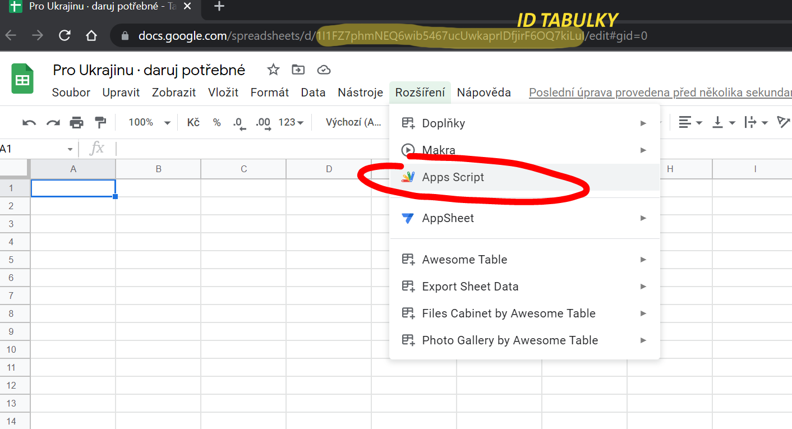
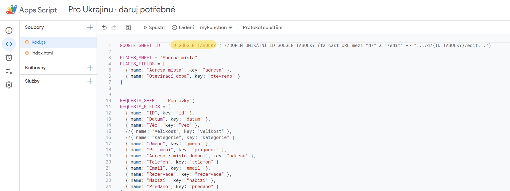
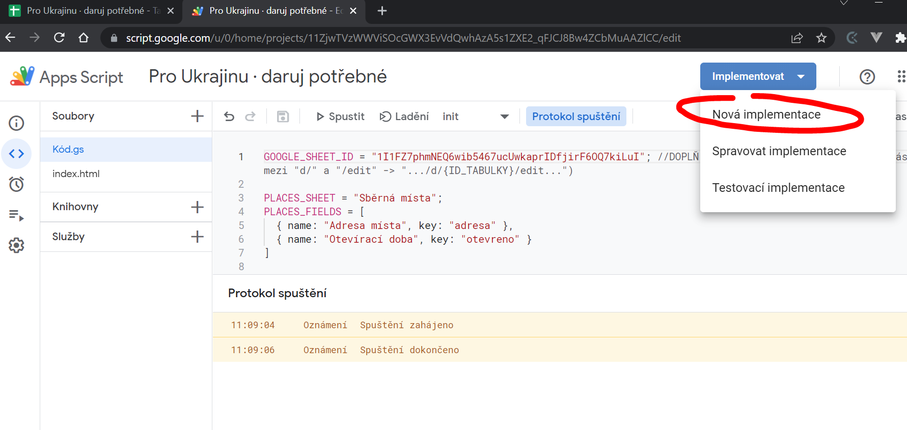
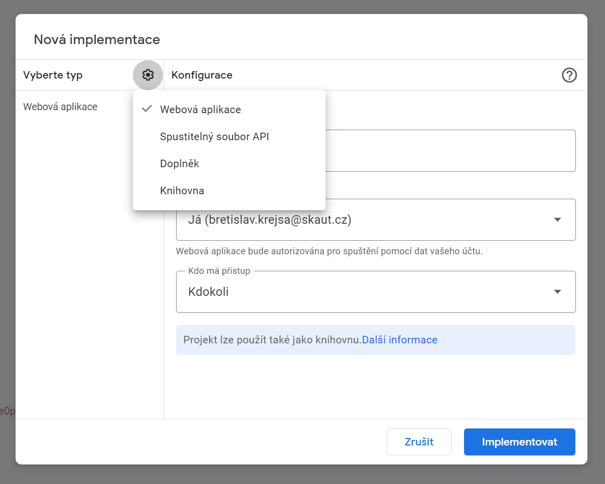
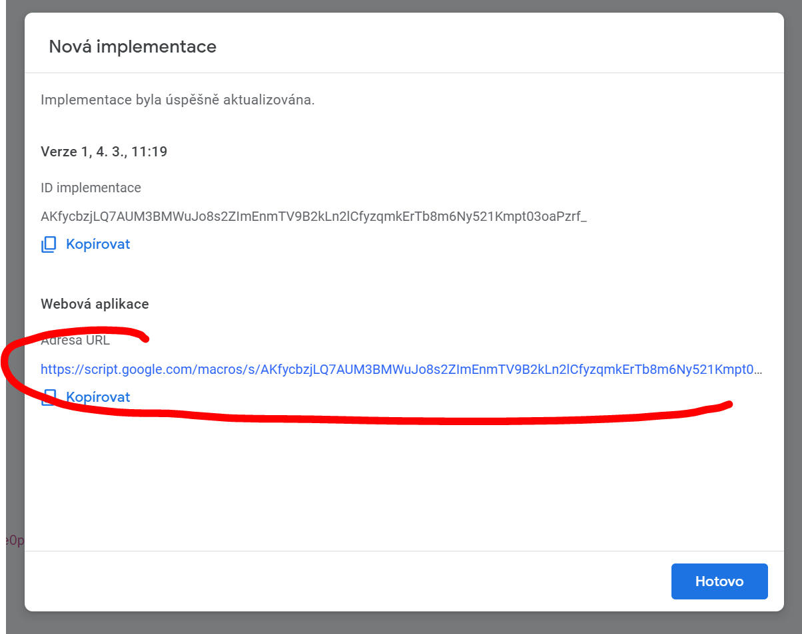

# Poptávko - nabídkový formulář materiální pomoci

## Instalace

### 1. Vytvoření Google tabulky a otevření editoru Apps Script



- Vytvořte si Google Tabulku v libovolné složce na Google Disku a otevřete jí. *(Nemám ověřenou funkčnost na Týmovém disku. Prosím o případnou zpětnou vazbu.)*
- Poznamenejte si ID Tabulky (ta část URL mezi d/ a "/edit" -> ".../d/**{ID_TABULKY}**/edit...").
- Klikněte na **Rozšíření > Apps Script**.

### 2. Vytvoření souborů **Kód.gs** a **index.html**



- Do souboru **Kód.gs** (defaultně vytvořen) vložte kód ze souboru [Kód.gs](https://raw.githubusercontent.com/bbscout/daruj-potrebne/main/K%C3%B3d.gs) z tohoto repozitáře.
  - na prvním řádku nahraďte u proměnné `GOOGLE_SHEET_ID` text *ID_GOOGLE_TABULKY* vlastním ID, které jste si poznamenali výše
- Vytvořte soubor **index.html** (defaultně vytvořen) a vložte do něj kód ze souboru [index.html](https://raw.githubusercontent.com/bbscout/daruj-potrebne/main/index.html) z tohoto repozitáře.
- Vše uložte pomocí symbolu diskety.

### 3. Inicializujte tabulku


- Z rozevíracího seznamu vyberte funkci `init` a klikněte na **Spustit**.
- Poprvé se vám objeví varování *"Je vyžadována autorizace. Tento projekt požaduje oprávnění pro přístup k vašim datům."*-
  - klikněte na **Zkontroloat oprávnění**
  - vyberte Google účet, který bude spouštět skript (musí mít přístup k tabulce)
  - potvrďte oprávnění skriptu v uvedeném rozsahu
- Pokud vše proběhne správně, pak se vám v tabulce objeví tři nové listy, se kterými bude skript pracovat.
- **Pokud se vám následně v Protokolu o spuštění na spodním okraji stránky objeví červeně chyba, tak máte nejspíš chybně zadané ID taulky.**

### 4. Implementujte skript jako webovou aplikaci





- Klikněte na tlačítko **Implementovat > Nová implementace**.
- Vyberte typ implementace **Webová aplikace**
- Upravte nastavení následujícím způsobem:
  - Název: **Libovolný název implementace**
  - Spustit jako: **Já**
  - Kdo má přístup: **Kdokoli**

### 5. Zkopírujte si URL webové aplikace



- zkopírujte si URL webové aplikace

### Hotovo

- webovou aplikaci můžete používat přímo zadáním URL `https://script.google...`, což není úplně uživatelsky přívětivé
- můžete použít zkracovač (např. [bit.ly](https://bit.ly))
- **webovou aplikaci můžete vložit pomocí iframe tagu na své stránky:**

    ```html
    <iframe src="https://script.google.com/a/macros/skaut.cz/s/AKfycbypHNCg1pQYvLQX3qSm9xZHA0WgX485TqQO5WLfClfN0Bhnzr_Rme6WATyTojFuEE-TyQ/exec" style="width:100%; height:2000px;">Načítám iframe</iframe>
    ```

  - doporučuji přizpůsobit výšku iframu vašim potřebám (upravit v části `height:2000px;`)

## Demo webové aplikace a tabulky

- [Demo webové aplikace](https://script.google.com/a/macros/skaut.cz/s/AKfycbzjLQ7AUM3BMWuJo8s2ZImEnmTV9B2kLn2lCfyzqmkErTb8m6Ny521Kmpt03oaPzrf_/exec)
- [Demo Google Tabulky](https://docs.google.com/spreadsheets/d/1I1FZ7phmNEQ6wib5467ucUwkaprIDfjirF6OQ7kiLuI/edit?usp=sharing)

## Co je v plánu

- překlad do ukrajinštiny a angličtiny pomocí knihovny i18n
